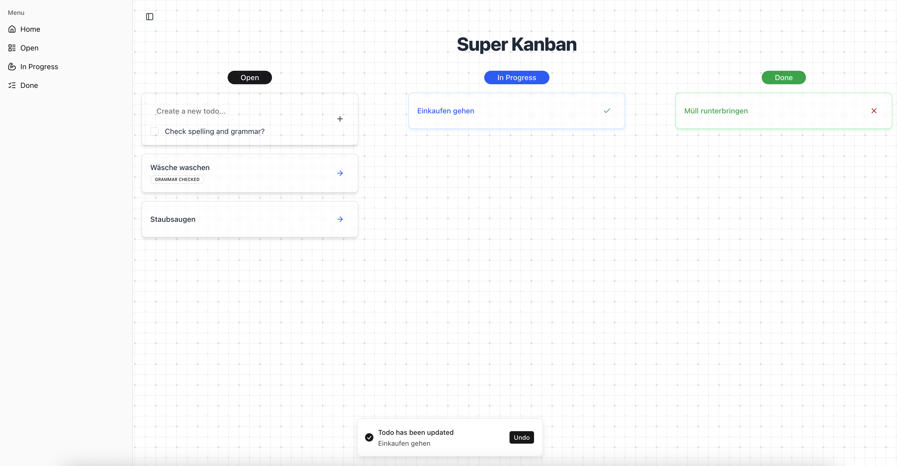

# Todo Frontend


Todo-Frontend for the [todo-backend](https://github.com/simonsagstetter/todo-backend/) written with Next.js as static
export so it can easily be used inside the `resource/static` folder of a spring boot web project. Just copy the contents
of the `out/` folder an setup the following `SPAController` component.

### SPA Controller

```java
import org.springframework.stereotype.Controller;
import org.springframework.web.bind.annotation.GetMapping;

@Controller
public class SPAController {

    @GetMapping(value = "/board/todo")
    public String todo() {
        return "forward:/board/todo.html";
    }

    @GetMapping(value = "/board/doing")
    public String doing() {
        return "forward:/board/doing.html";
    }

    @GetMapping(value = "/board/done")
    public String done() {
        return "forward:/board/done.html";
    }

}

```

## Screenshot



## Getting Started

First, run the development server:

```bash
npm run dev
# or
yarn dev
# or
pnpm dev
# or
bun dev
```

Open [http://localhost:3000](http://localhost:3000) with your browser to see the result.

## Learn More

To learn more about Next.js, take a look at the following resources:

- [Next.js Documentation](https://nextjs.org/docs) - learn about Next.js features and API.
- [Learn Next.js](https://nextjs.org/learn) - an interactive Next.js tutorial.

You can check out [the Next.js GitHub repository](https://github.com/vercel/next.js) - your feedback and contributions
are welcome!
